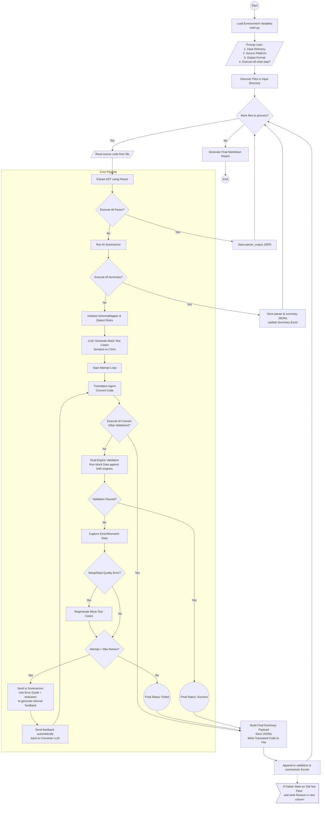

# Agentic SQL Converter

Agentic SQL Converter is an AI-powered code translation and validation pipeline. It converts legacy SQL dialects (like SQL Server or Azure Synapse) and PySpark code into optimized Databricks Unity Catalog SQL, PySpark, or Scala code. It leverages an LLM-powered schema mapping, mock test data generation, and a rigorous dual-engine validation process to ensure the accuracy of converted code.

## 🌟 Features

- **Multi-Language Support**: Input SQL or PySpark. Output raw SQL, PySpark DataFrame code, or Databricks Python/Scala notebooks.
- **AST Parsing & Intelligent Summarization**: Extracts Abstract Syntax Trees (AST) and generates comprehensive AI summaries of tables, schemas, and functions before attempting conversion.
- **Automated Mock Testing**: Automatically generates boundary, edge, and normal test datasets (CSVs) using AI to validate conversion accuracy.
- **Dual-Engine Validation**: Executes the generated test cases against both the source engine (e.g., SQL Server) and target engine (Databricks SQL Warehouse) to compare outputs and ensure 100% equivalence.
- **Self-Healing LLM Feedback Loop**: If validation fails due to syntax or data quality mismatch, the system automatically captures the error, sends it to the summarizer, generates internal feedback, and retries the translation automatically without user intervention.
- **Flexible Execution Modes**: Run partial pipelines (e.g., AST parser only, summary only, or full translation and validation). Available in both Batch mode and Interactive CLI mode.

## 📂 Project Structure

```text
sql-converter-ai/
├── agents/                 # LLM agents (conversion, validation, summarization, etc.)
├── parsers/                # AST parsers for SQL and PySpark
├── rag/                    # Retrieval-Augmented Generation context (Dialect rules, Error manual)
├── src/                    # Core pipeline logic (converter, dual validator, mapper, reporters)
├── utils/                  # Utility functions (file reading, reporting, etc.)
├── input/                  # Default directory for source code files to convert
├── output/                 # Generated outputs (JSONs, Excels, Reports, Translated code)
├── main.py                 # Main entry point for the Automated Batch Pipeline
├── interactive_cli.py      # Entry point for the Interactive CLI mode
├── requirements.txt        # Python dependencies
└── .env                    # Environment variables configuration
```

## ⚙️ Architecture Flow

The following diagram illustrates the automated Waterfall Architecture of the `main.py` batch pipeline:



## 🚀 Getting Started

### Prerequisites

1. Python 3.10+
2. A running Databricks SQL Warehouse instance.
3. A running SQL Server instance (for Dual-Engine Validation).

### Installation

1. Clone the repository:
   ```bash
   git clone https://github.com/your-username/sql-converter-ai.git
   cd sql-converter-ai
   ```

2. Install dependencies:
   ```bash
   pip install -r requirements.txt
   ```

3. Setup environment variables:
   Create a `.env` file in the root directory and configure the following connections:
   ```env
   DATABRICKS_HOST=your_databricks_host
   DATABRICKS_TOKEN=your_databricks_token
   DATABRICKS_HTTP_PATH=your_databricks_http_path
   SQL_SERVER_HOST=your_sql_server_host
   SQL_SERVER_DB=your_sql_server_db
   SOURCE_DIALECT=SQL Server
   ```

## 💻 Usage

### 1. Batch Mode (Automated Pipeline)
The standard execution mode processes all files inside a given directory, outputting detailed summaries, JSON logs, Excel validation reports, and the translated files to the `output/` directory.

```bash
python main.py --input-dir input/ --run full --output-lang sql
```

**CLI Arguments:**
- `--input-dir`: Path to the folder containing source files (`.sql`, `.py`, `.ipynb`).
- `--run`: Choose the execution depth:
  - `parser`: Only extract the AST and save JSONs.
  - `summary`: Parse and summarize code, update Excel reports.
  - `convert`: Translate code but skip Dual-Engine Validation.
  - `full`: End-to-end Translation + LLM Mock Generation + Dual-Engine Validation.
- `--output-lang`: Target output format (`sql`, `pyspark`, `py`, `scala`).
- `--source-platform`: E.g., `SQL Server`, `Azure Synapse`.

### 2. Interactive CLI Mode
If you prefer to paste queries one by one and manually approve or guide the AI's translation, use interactive mode:

```bash
python main.py --interactive
# OR
python interactive_cli.py
```

## 📊 Outputs

All outputs are neatly generated inside the `output/` directory:
- `parser_outputs/`: Raw AST extraction data.
- `summary_outputs/`: AI-generated code summaries detailing tables and functions.
- `test_cases/`: LLM-generated CSV datasets for boundary/edge/normal tests.
- `final_result/`: The fully translated code files.
- `validation_excels/`: Detailed Excel grids tracking passed/failed test cases.
- `summarizer_excels/`: High-level tracking reports for batch migrations.
